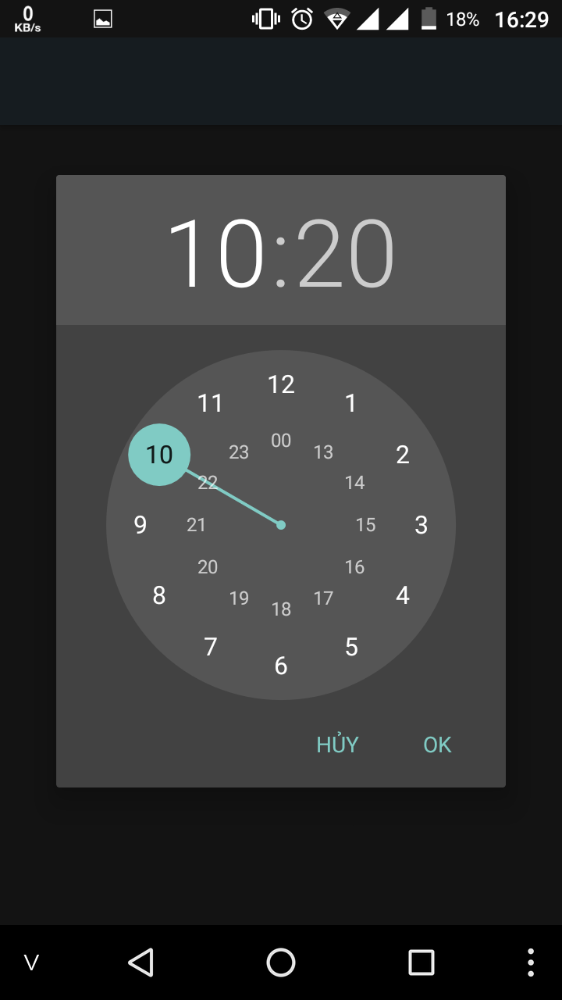

# Tạo một số dạng dialog với Pascal NIDE - Thư viện aDialog

## Tổng quan

Thư viện này giúp cho các bạn có thể tạo các dialog để có thể giao tiếp với người dùng một cách dễ dàng hơn trong việc nhập dữ liệu như ngày tháng, thời gian, mật khẩu hay hiển thị một thông báo đến người dùng

## Các hàm và phương thức
### dialogAlert

Đây là dạng dialog cơ bản nhất giúp hiển thị một thông báo.

Cú pháp
```pascal
procedure dialogAlert(title, msg: string; wait: boolean);
```
Tham số;
* ``title`` là tiêu đề của dialog
* ``msg`` là nội dung cần thông báo.
* ``wait`` nếu giá trị là ``true``, chương trình sẽ tạm dừng cho đến khi đóng dialog

Ví dụ

```pascal
Uses 
    aDialog;
Var
    title, msg, result: string;
Begin
    title := 'Xin chào';
    msg := 'Đây là phần mềm Pascal NIDE';
    dialogAlert (title, msg, true);
    Readln;
End.
```
___
### dialogGetInput

Đây là dạng dialog mà khi hiển thị sẽ có một ô cho người dùng nhập dữ liệu vào

Cú pháp
```pascal
Function dialogGetInput (title, hint, defaultText: string): string;
```

Tham số

* ``title`` là tiêu đề của dialog
* ``hint`` là gợi ý
* ``defaultText`` là chuỗi mặc định sẽ được hiển thị


Ví dụ 
```pascal
Uses 
    aDialog;
Var
    title, hint, result: string;
Begin
    title := 'Tên của bạn là gì?';
    Hint := 'nhập vào đây';
    result := dialogGetInput (title, hint, '');
    Writeln('xin chào ' + result);
    Readln;
End.
```
___
### dialogGetPassword

Đây là dạng dialog mà khi hiển thị sẽ có một ô cho người dùng nhập mật khẩu vào

Cú pháp
```pascal
Function dialogGetPassword (title, hint: string): string;
```
Tham số;
* ``title`` là tiêu đề của dialog
* ``hint`` là gợi ý

Ví dụ 
```pascal
Uses 
    aDialog;
Var
    title, hint, result: string;
Begin
    title := 'Nhập tên của bạn';
    Hint := 'nhập vào đây';
    result := dialogGetPassword (title, hint);
    Writeln('Mật khẩu của bạn là ', result);
    Readln;
End.
```
___
### dialogGetTime

Đây là dạng dialog mà sẽ hiển thị một hộp thoại cho người dùng chọn thời gian

Cú pháp

```pascal
Function dialogGetTime(defHour, defMinute: integer): org_json_JSONObject;
```

JSON là một dạng dữ liệu đặc biệt làm việc theo từng cặp khoá ``<key, value>``

* Muốn lấy giờ ta dùng key ``hour``
* Muốn lấy phút ta dùng key ``minute``

Ví dụ

```pascal
uses
    aDialog;
var
    result: org_json_JSONObject;
    minute: Integer;
    hour: Integer;
begin
    //hh/mm 24h
    result := dialogGetTime(10, 20, true);

    hour := result.getInt('hour');
    minute := result.getInt('minute');

    writeln('time = ', hour, ':' , minute);
end.
```
___
### dialogGetDate

Đây là dạng dialog mà sẽ hiển thị một hộp thoại cho người dùng chọn ngày tháng

Cú pháp
```pascal
Function dialogGetDate(defYear, defMonth, defDay: integer): org_json_JSONObject;
```
JSON là một dạng dữ liệu đặc biệt làm việc theo từng cặp khoá ``<key, value>``

* Muốn lấy năm ta dùng key ``year``
* Muốn lấy tháng ta dùng key ``month``
* Muốn lấy ngày ta dùng key ``day``

Ví dụ 
```pascal
uses
    aDialog;
var
    result: org_json_JSONObject;
    year, month, day: Integer;
begin
    //yyyy/mm/dd
    result := dialogGetDate(2017, 7, 12);

    year := result.getInt('year');
    month := result.getInt('month');
    day := result.getInt('day');

    writeln('date = ', day, '/' , month,'/', year);
end.
```

## Some image (all code in CodeSample -> Tab Android)





