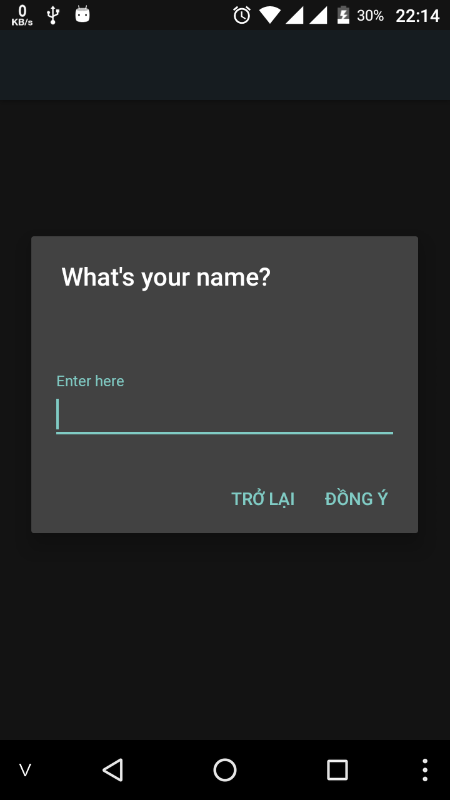

# Create some kind of dialog with Pascal N-IDE - aDialog library

## Overview

This library makes it easier for you to create dialogs that make it easier for users to communicate with data such as date, time, password, or display a message to the user.

## Functions and Procedures

### dialogAlert

This is the most basic form of dialog to display a message.

Syntax
```pascal
procedure dialogAlert(title, msg: string; wait: boolean);
```
Parameters;
* ``title`` is the title of the dialog
* ``msg`` is the content to be notified.
* ``wait`` if value is ``true``, the program will be block until the dialog closed

Example

```pascal
Uses
    aDialog;
Var
    title, msg, result: string;
Begin
    title := 'Hello';
    msg := 'This is Pascal NIDE';

    DialogAlert(title, msg, true); //<==

    Readln;
End.
```
___
### dialogGetInput

This is a dialog which displayed a edit text for the user to enter data

Syntax

```pascal
function dialogGetInput(title, hint, defaultText: string): string;
```

Parameters

* ``title`` is the title of the dialog
* ``hint`` is a hint
* ``defaultText`` is the default string that will be displayed


Example

```pascal
Uses
    aDialog;
Var
    title, hint, result: string;
Begin
    title := 'What''s your name?';
    hint := 'Enter here';

    result := dialogGetInput(title, hint, ''); //<==

    Writeln('hello' + result);
    Readln;
End.
```
___
### dialogGetPassword

This is a dialog which displayed a edit text for the user to enter the password

Syntax

```pascal
function dialogGetPassword(title, hint: string): string;
```

Parameters

* ``title`` is the title of the dialog
* ``hint`` is a hint

Example

```pascal
Uses
    aDialog;
Var
    title, hint, result: string;
Begin
    title := 'What is your password?';
    hint := 'enter here';

    result := dialogGetPassword(title, hint);

    Writeln('Your password is', result);
    Readln;
End.
```
___
### dialogGetTime

This is a dialog which display a time picker for the user to select the time

Syntax

```pascal
function dialogGetTime(defHour, defMinute: integer; is24h: boolean): org_json_JSONObject;
```

Parameters

* ``defHour`` is default hour
* ``defMinute`` is default minute
* ``is24h``: if value is ``true``, the dialog will be display mode 24h, else 12h

JSON is a special type of data that works in pairs of ``<key, value> ``

* To get time we use the key ``hour``
* Want to take minutes we use the key ``minute``

Example

```pascal
Uses
    aDialog;
Var
    result: org_json_JSONObject;
    Minute: Integer;
    Hour: Integer;
Begin
    //  hh/mm 24h
    result := dialogGetTime(10, 20, true);

    Hour := result.getInt('hour');
    Minute := result.getInt('minute');

    Writeln('time =', hour, ':', minute);
End.
```
___
### dialogGetDate

This is a dialog that displays a dialog box for the user to select a date

Syntax
```pascal
function dialogGetDate(defYear, defMonth, defDay: integer): org_json_JSONObject;
```

JSON is a special type of data that works in pairs of ``<key, value> ``

* Want to retrieve the year using the key ``year``
* To get months we use the key ``month``
* Want to get the date we use the key ``day``

Example

```pascal
Uses
    aDialog;
Var
    result: org_json_JSONObject;
    Year, month, day: Integer;
Begin
    // yyyy / mm / dd
    result := dialogGetDate(2017, 7, 12);

    Year := result.getInt('year');
    Month := result.getInt('month');
    Day := result.getInt('day');

    Writeln('date =', day, '/', month, '/', year);
End
```

## Some image (all code in CodeSample -> Tab Android)


